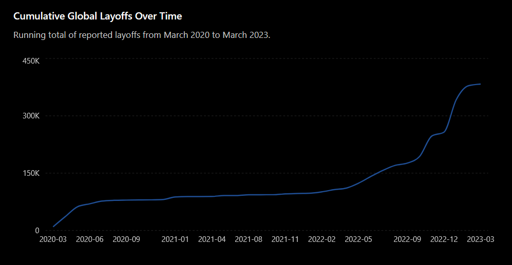
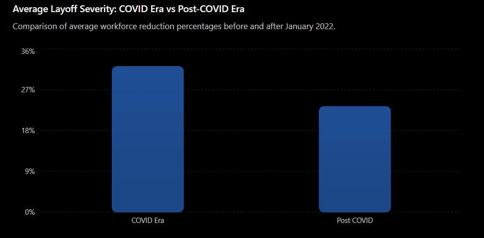
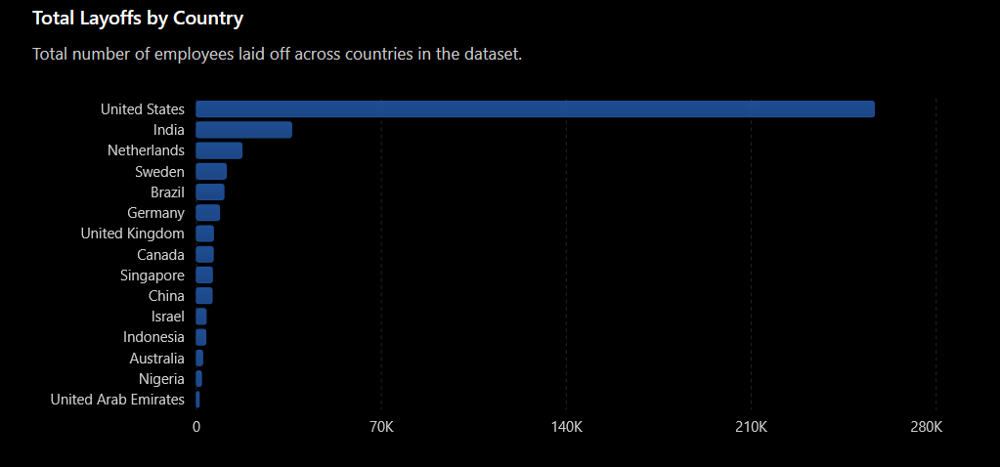
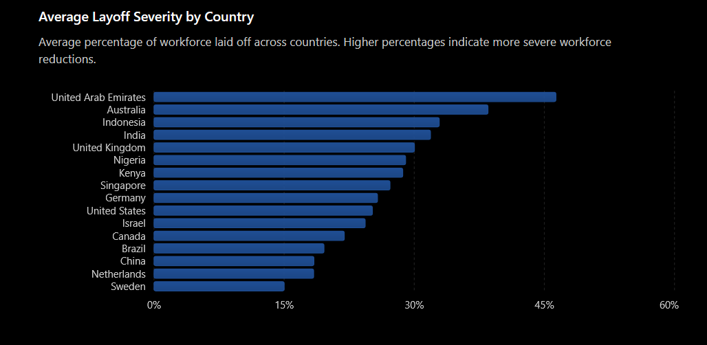
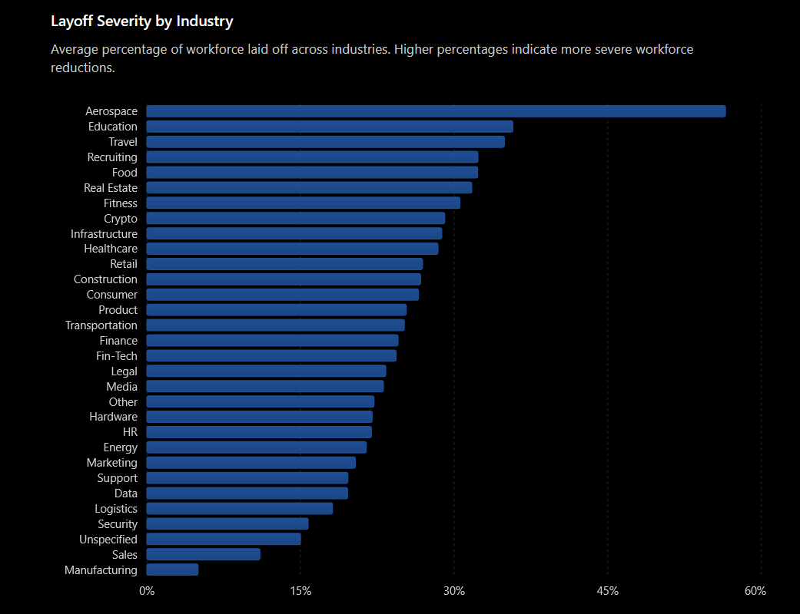
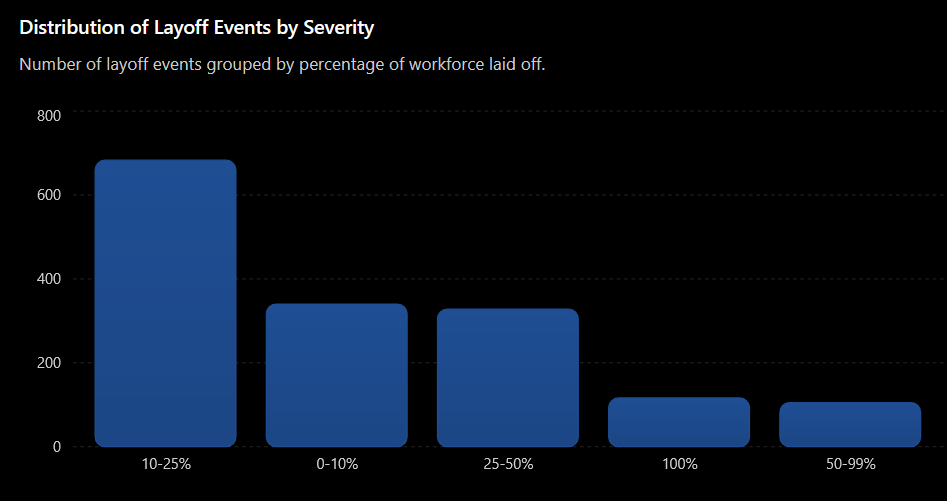
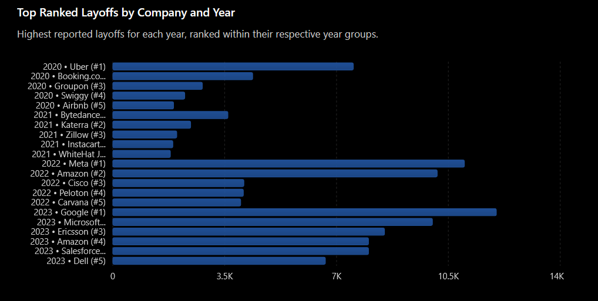

<!-- markdownlint-disable MD041 -->


# SQL EDA Project: World Layoffs Analysis


This project performs Exploratory Data Analysis (EDA) on a layoffs dataset using SQL. The dataset contains information about company layoffs, including company name, location, industry, number of people laid off, percentage laid off, date, stage, country, and funds raised.

----

## 🔖 Table of Contents

- [Overview](#-overview)
- [Dataset](#-dataset)
- [Project Structure](#-project-structure)
- [Prerequisites](#prerequisites)
- [Setup and Usage](#-setup-and-usage)
- [Data Cleaning Steps](#-data-cleaning-steps)
- [Results](#-results)
- [Key Findings](#-key-findings)
- [SQL Concepts Used](#-sql-concepts-used)
- [Future Improvements](#-future-improvements)

----

## 🔶 Overview

- This project presents an end-to-end exploratory data analysis of global layoffs reported between 2020 and 2023 using PostgreSQL.
- The dataset was cleaned, standardized, and enriched through extensive data validation and missing-value handling, including research-based verification of funding information.
- Through SQL-driven analysis, the project examines layoff trends across countries, industries, company funding stages, and time periods, while comparing workforce reduction patterns during and after the COVID-19 pandemic.
- The analysis uncovers key business insights into layoff volume, severity, and the shifting factors that drove workforce reductions across the global startup and technology ecosystem.

----

## 📈 Dataset

The dataset used is `layoffs.csv`, which contains information about layoffs from various companies. The original data had inconsistencies in data types, duplicate entries, and formatting issues that required cleaning.

### Original Columns

- `company`: Company name
- `location`: Company location
- `industry`: Industry sector
- `total_laid_off`: Number of employees laid off
- `percentage_laid_off`: Percentage of workforce laid off
- `date`: Date of layoff (originally stored as text in MM/DD/YYYY format)
- `stage`: Company stage (e.g., Startup, Public, etc.)
- `country`: Country where the company is based
- `funds_raised_millions`: Funds raised by the company in millions

----

## 📁 Project Structure

```
.
├── .gitignore                # Git ignore file
├── layoffs.csv               # Raw data CSV file
├── loading_data.sql          # SQL script to create table and load data
├── Cleaning.sql              # SQL script to clean the loaded data
└── README.md                 # This file
```

----

## Prerequisites

- [PostgreSQL](https://www.postgresql.org/) (version 9.5 or higher recommended)
- A SQL client to run the scripts (e.g., psql, pgAdmin, DBeaver)

----

## 💻 Setup and Usage

1. **Ensure PostgreSQL is running** and you have access to a database where you can create tables.
2. **Create a database**:

   ```sql
   CREATE DATABASE layoffs_eda;
   ```

3. **Connect to your database**:

   ```bash
   psql -U your_username -d layoffs_eda
   ```

4. **Run the loading script** to create the initial table and load the CSV data:

   ```sql
   \i loading_data.sql
   ```

   Note: The script uses an absolute path to the CSV file. You may need to modify the path in `loading_data.sql` to point to where `layoffs.csv` is located on your system.
5. **Run the cleaning script** to create and populate the cleaned table:

   ```sql
   \i Cleaning.sql
   ```

6. After running both scripts, you will have a table named `clean_layoffs` in your database, ready for analysis.

----

## 🧼 Data Cleaning Steps

The `Cleaning.sql` script performs the following operations:

1. **Create a duplicate table** (`clean_layoffs`) to work on without altering the original data.
2. **Verify data types** using the `information_schema`.
3. **Reformat columns** to appropriate data types:
   - `total_laid_off` → INTEGER
   - `percentage_laid_off` → DECIMAL
   - `date` → DATE (using `TO_DATE` with format 'YYYY/MM/DD')
   - `funds_raised_millions` → DECIMAL
4. **Check for and remove duplicate rows** based on all columns using the `CTID` system column.
5. **Standardize text data**:
   - Trim whitespace from `company`
   - Standardize `industry` (e.g., variations of 'Crypto' to 'Crypto')
   - Remove trailing periods from `country` (e.g., 'United States.' → 'United States')
6. **Handle missing values**:
   - Convert empty strings in `industry` to NULL
   - Populate NULL `industry` values by referencing the same company's known industry
   - Remove rows where both `total_laid_off` and `percentage_laid_off` are NULL (considered irrelevant for analysis)

----

## ✅ Results

After running the cleaning script, the `clean_layoffs` table will contain:

- Consistent data types
- No duplicate rows
- Standardized text fields
- Missing values handled appropriately
- A clean dataset suitable for further exploratory analysis, visualization, or modeling.

You can now run analytical queries on `clean_layoffs`, such as:

- Total layoffs by year
- Layoffs by industry
- Companies with the highest layoffs
- Trends over time

### EDA (Exploratory Data Analysis) Insights

### 1. Global Lay-offs by Year(2020 - 2023)

.png)

**Key Insights:**

Layoffs peaked in 2022 (160,661 employees) and remained elevated in 2023 (125,677 employees). While COVID-19 triggered the initial wave in 2020, the largest workforce reductions occurred during the post-pandemic tech and startup correction.

### 2. Cumulative Global Layoffs Over Time



**Key Insights:**

The cumulative layoff trend shows two major disruption periods: the COVID-19 shock in 2020 and the technology-sector correction in 2022–2023. By March 2023, cumulative layoffs exceeded 340,000 employees worlwide.

### 3. Average Layoff Severity — COVID Era vs Post-COVID Era


**Key Insights:**

Companies laid off an average of 32.19% of their workforce during the COVID era compared to 23.35% in the post-COVID period. This suggests that pandemic-era layoffs were generally more severe, despite fewer employees being affected overall.

### 4. Total Layoffs by Country


**Key Insights:**

The United States accounted for the highest number of layoffs, with over 256,000 employees affected, far exceeding every other country. India ranked second, reflecting the impact of the global slowdown on major technology and startup ecosystems.

### 5. Average Layoff Severity by Country


**Key Insights:**

Companies in the United Arab Emirates (46.3%) and Australia (38.5%) experienced the deepest workforce reductions on average. In contrast, the United States recorded a lower average layoff percentage despite having the highest number of layoffs overall.

### 6. Total Layoffs by Funding Stage


**Key Insights:**

Post-IPO companies generated the largest number of layoffs, accounting for more than 204,000 affected employees. This indicates that large public companies played a major role in the global layoff wave.

### 7. Layoff Severity by Funding Stage


**Key Insights:**

Seed-stage startups experienced the most severe workforce reductions, laying off an average of 70.17% of employees. Although Post-IPO firms generated more layoffs overall, their average layoff percentage was significantly lower.
This suggests that younger startups were significantly more vulnerable to
economic downturns due to limited financial reserves and greater dependence
on external funding.

### 8. Layoff Severity by Industry



**Key Insights:**

The Aerospace, Education, and Travel sectors recorded the highest layoff severity, with average workforce reductions exceeding 35%. Meanwhile, Manufacturing, Security and Logistics experienced relatively low workforce reductions, indicating greater operational stability.

### 9. Distribution of Layoff Events by Severity



**Key Insights:**

Most layoff events involved moderate workforce reductions (10–25%), accounting for over 40% of all recorded cases. Large-scale workforce eliminations were comparatively rare, suggesting that most companies opted for controlled restructuring rather than complete shutdowns.

### 10. Top Companies by Layoffs per Year


**Key Insights:**

The companies driving layoffs shifted over time. Travel and mobility firms such as Uber and Booking.com dominated layoffs during COVID-19, while technology giants including Google, Microsoft, Meta, Amazon, and Salesforce led the post-pandemic layoff wave. This shift highlights how the causes of layoffs evolved from pandemic-related demand shocks to post-pandemic workforce optimization and economic tightening.

----

## 📌 Key Findings

- More than 383,000 employees were affected by layoffs between 2020 and 2023.
- Layoffs peaked in 2022 and remained elevated throughout 2023.
- The United States recorded the highest number of layoffs, while the UAE experienced the highest average layoff severity.
- Post-IPO companies accounted for the largest share of layoffs, but Seed-stage startups experienced the most severe workforce reductions.
- Aerospace, Education, and Travel were among the industries with the highest layoff severity.
- Most companies reduced between 10% and 25% of their workforce rather than conducting mass layoffs.
- The primary drivers of layoffs shifted from pandemic-related disruptions in 2020 to technology-sector restructuring and cost optimization in 2022–2023.

----

# 📖 SQL Concepts Used

- Window Functions
- CTEs
- Aggregations
- CASE Statements
- Ranking Functions
- Data Cleaning
- NULL Handling

----

# 🔮 Future Improvements

- Build an interactive Power BI dashboard
- Add predictive layoff trend analysis
- Integrate macroeconomic indicators
